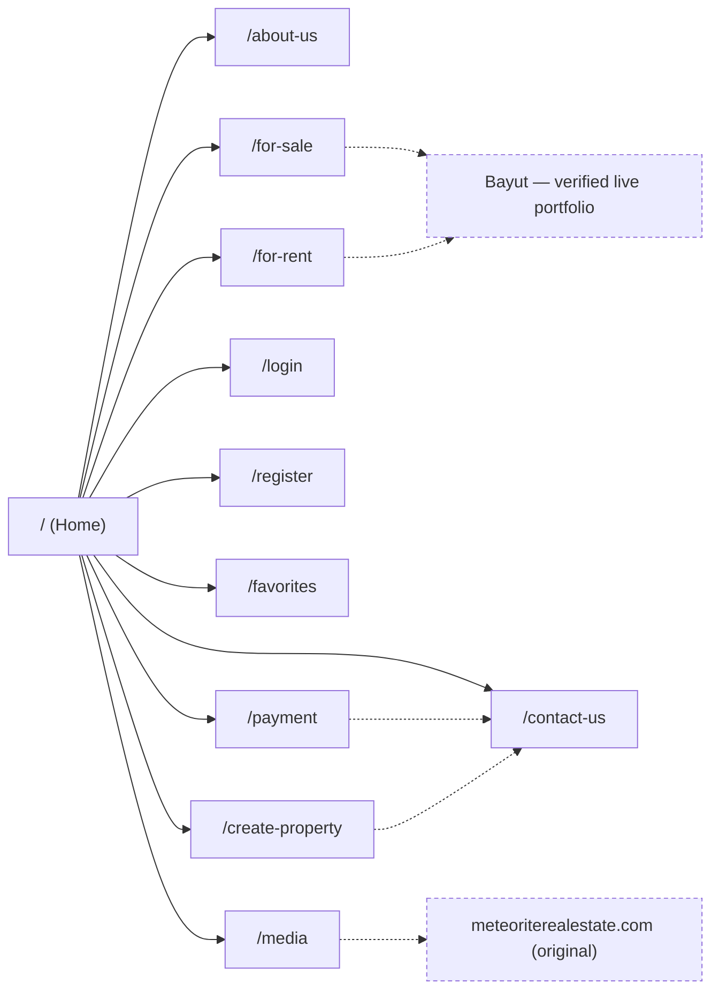

<div align="center">


### A Liquid Glass redesign of a real Dubai brokerage's website

RERA-certified · Trusted since 2005 · Built with Next.js, TypeScript, Tailwind CSS v4 & Framer Motion

[](https://nextjs.org)
[](https://www.typescriptlang.org)
[](https://tailwindcss.com)
[](https://react.dev)
[](https://www.framer.com/motion/)
[](#quality-checks)
[](#quality-checks)

</div>

---

## Contents

- [About](#about)
- [Features](#features)
- [Site map](#site-map)
- [Tech stack](#tech-stack)
- [Getting started](#getting-started)
- [Project structure](#project-structure)
- [Verified content policy](#verified-content-policy)
- [Known gaps &amp; roadmap](#known-gaps--roadmap)
- [Quality checks](#quality-checks)

## About

Meteorite Real Estate is a RERA-certified Dubai property brokerage operating since 2005. This repository is a ground-up rebuild of its public website — the previous repo held only a placeholder `README.md` — designed around Apple's **Liquid Glass** language: translucent, frosted surfaces, soft depth and light, and purposeful motion. The palette is the company's own navy and gold, never a generic AI purple/blue gradient, and every fact on the site — logo, contact details, credentials, statistics, testimonials, and the full agent roster — is sourced directly from the live site rather than invented.


## Features

| | |
|---|---|
| 🏠 **Homepage** | Hero, live stats counter, company intro, property discovery, leadership, team, testimonials, contact CTA |
| 🥃 **Liquid Glass UI** | Frosted `.glass` panels, animated navy/gold glow fields, shimmering hover borders — no generic AI-purple gradients |
| 🎞️ **Motion** | Framer Motion scroll reveals, staggered card entrances, hero parallax-style fade-ins — all reduced-motion aware |
| 🧭 **Navigation** | Glass sticky header that reacts to scroll, full mobile menu, all original nav destinations preserved |
| 🏢 **Property discovery** | Category browsing (Apartments, Villas, Townhouses, Commercial) linking to the company's verified Bayut portfolio |
| 👤 **Leadership section** | Editorial profile for CEO & Founder Saad Abdullah Soboh, with real portrait and verified bio |
| 🧑‍💼 **Team section** | Full 3-agent roster from the live site's `/agents/` directory, real photos, real profile links |
| 🔐 **Auth UI** | Sign in / register with validation, password visibility toggle, and an honest guest mode |
| ⭐ **Favorites** | Guest-friendly, `localStorage`-backed saved properties |
| ♿ **Accessibility** | Visible focus states, alt text, reduced-motion support, semantic landmarks |
| 📱 **Responsive** | Tested from 390px mobile up through desktop, no horizontal overflow |

## Site map



## Tech stack

| Layer | Choice |
|---|---|
| Framework | [Next.js 16](https://nextjs.org) (App Router) |
| Language | TypeScript |
| Styling | Tailwind CSS v4 (CSS-first `@theme` tokens) + a small Liquid Glass utility layer in `globals.css` |
| Animation | [Framer Motion](https://www.framer.com/motion/) (`Reveal.tsx` scroll-in wrapper, hero entrance, `useReducedMotion`-aware) |
| UI runtime | React 19 |
| Fonts | `next/font` — Inter |
| State | React Context (`AuthProvider`, `FavoritesProvider`) + `localStorage` |
| Linting | ESLint (`eslint-config-next`) |

### Liquid Glass design system

Three CSS primitives in [`globals.css`](src/app/globals.css), composed rather than hard-coded per component:

| Class | Effect |
|---|---|
| `.glass` / `.glass-dark` | Frosted, translucent panel (`backdrop-filter: blur + saturate`) in the brand's own light or navy tone |
| `.glow-field` | Two soft, slowly drifting navy/gold blur blooms behind a section — the color that the glass refracts |
| `.shimmer-border` | A thin animated gold sheen that sweeps a card's border on hover |

All three respect `prefers-reduced-motion` and fall back to a static frosted card with no animation.

## Getting started

```bash
npm install
npm run dev
```

Then open **[http://localhost:3000](http://localhost:3000)**.

```bash
npm run build   # production build
npm run lint    # ESLint
npm run start   # serve the production build
```

## Project structure

```
src/
├─ app/                  routes (App Router) — one folder per page
│  ├─ about-us/  contact-us/  for-sale/  for-rent/
│  ├─ login/  register/  favorites/
│  └─ media/  payment/  create-property/
├─ components/           section & UI components (Header, Hero, CeoSection, ...)
└─ lib/
   ├─ content.ts         ⚠️ single source of truth for every verified fact
   ├─ auth-context.tsx   guest-first auth state (no backend wired yet)
   └─ favorites-context.tsx   localStorage-backed saved properties
public/brand/            logo, hero photo, CEO portrait — pulled from the live site
```

## Verified content policy

Every company fact rendered on this site — phone numbers, email, RERA ORN, broker card, address, statistics, testimonials, and the leadership/agent names, titles, and bios — lives in one place, [`src/lib/content.ts`](src/lib/content.ts), and was sourced directly from **meteoriterealestate.com** on 2026-09-17. No prices, reviews, or credentials are fabricated anywhere in this codebase.

> **Discrepancy found on the live site:** the `/agents/` profile template displays "CEO and Founder" above *every* agent's name, including the two non-founder agents (Hattab, Zamily) — almost certainly an unedited CMS default, since the About page and public records identify only Saad Abdullah Soboh as CEO and Founder. This build labels the other two agents "Agent" (their own breadcrumb category on the live site) instead of repeating what reads as a templating error. Flagging this for the company to fix at the source.

> If you update a fact in `content.ts`, cite where it came from in the commit message.

## Known gaps & roadmap

| Area | Status | What's needed |
|---|---|---|
| Authentication | 🟡 UI complete, not wired | Connect a real provider (Supabase Auth, NextAuth + DB adapter). Currently shows an honest "not connected" notice instead of a fake successful login. |
| Native property listings | 🟡 Linked out | Live site exposes no scrapable structured listing data (prices/specs). Pages link to the company's real Bayut portfolio instead of fabricated cards. |
| Favorites sync | 🟡 Device-local only | Needs real property IDs + an account backend to sync across devices. |
| Media / Payment / Add Property | 🟡 Linked out | Original page content on WordPress couldn't be verified or migrated — these link to the live pages / WhatsApp / email instead. |

## Quality checks

- ✅ `npm run build` — all 12 routes compile and prerender
- ✅ `npm run lint` — zero errors
- ✅ All routes return `200`, all brand images resolve
- ⚠️ No pixel-level browser screenshot testing performed in this environment (no headless browser tooling available) — verified via build/lint/HTTP checks instead

---

<div align="center">
<sub>Built for Meteorite Real Estate · Dubai, UAE</sub>
</div>
