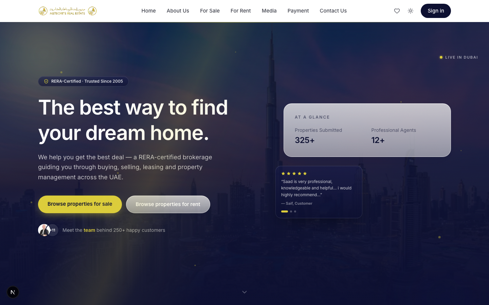
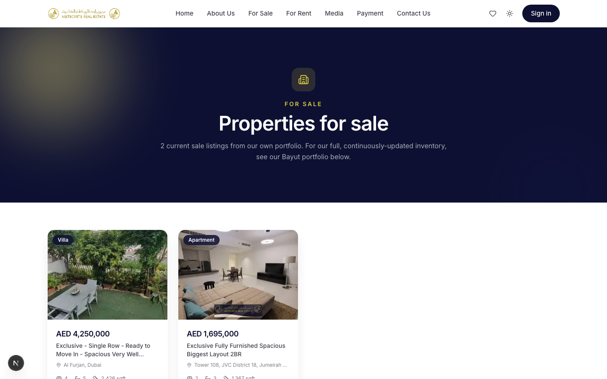
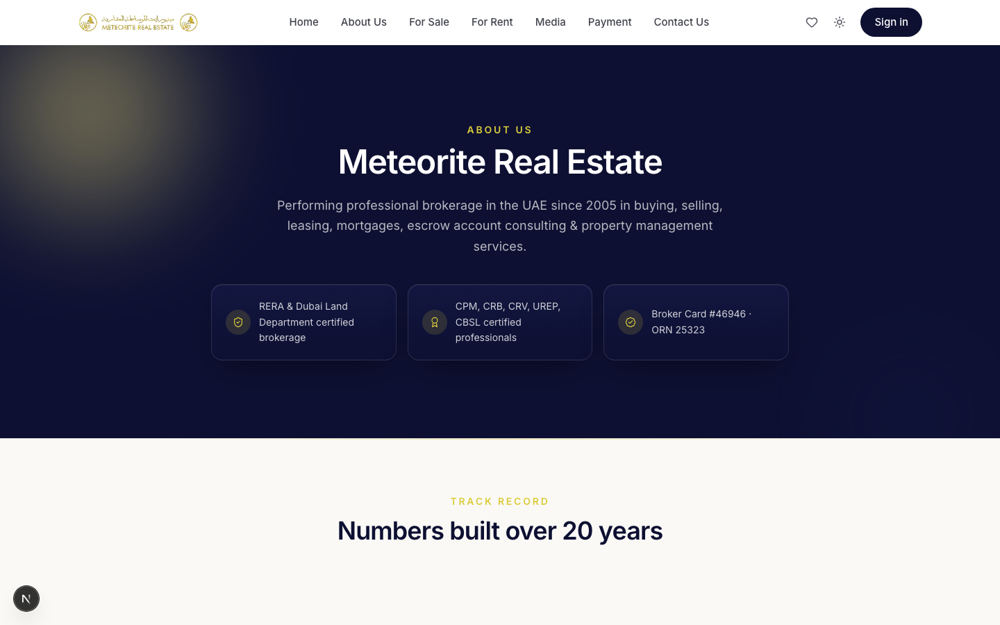
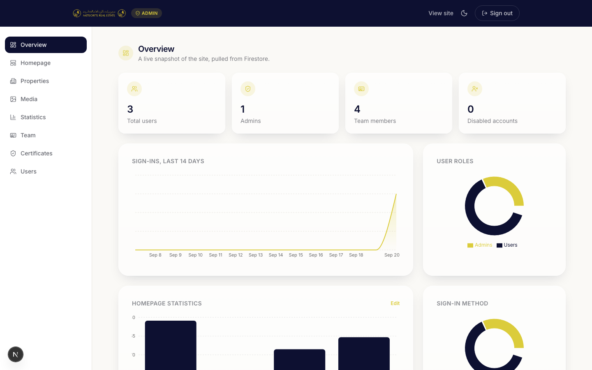
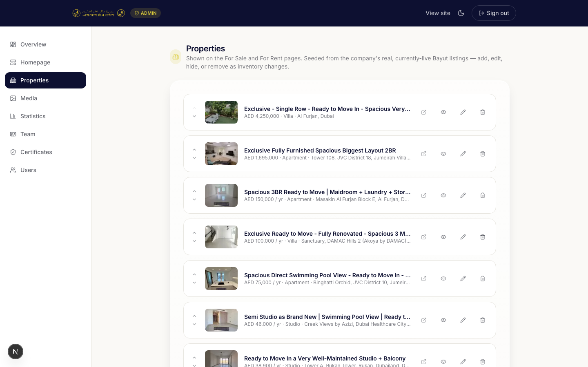
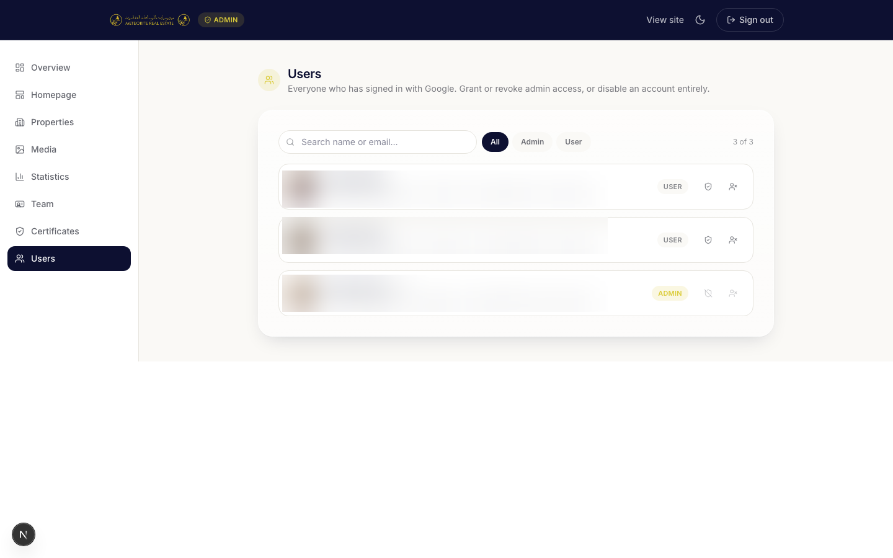
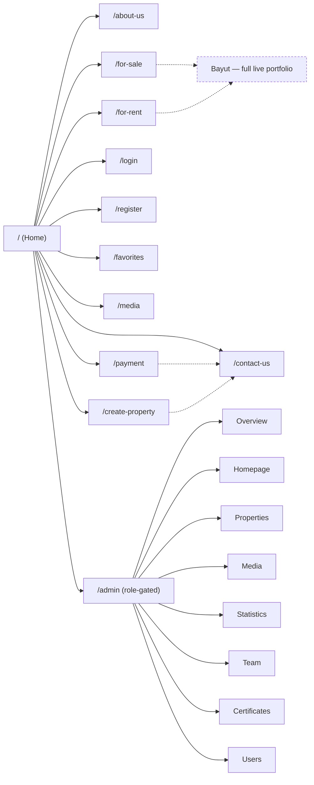

<div align="center">


### A real Dubai brokerage's website — redesigned, backed by Firebase, and deployed on Cloudflare Workers

RERA-certified · Trusted since 2005 · Next.js 16 · TypeScript · Tailwind CSS v4 · Firebase · Cloudflare Workers

[](https://nextjs.org)
[](https://www.typescriptlang.org)
[](https://tailwindcss.com)
[](https://firebase.google.com)
[](https://workers.cloudflare.com)
[](#quality-checks)
[](#quality-checks)

</div>

---

## Contents

- [About](#about)
- [Screenshots](#screenshots)
- [Features](#features)
- [Admin dashboard](#admin-dashboard)
- [Site map](#site-map)
- [Tech stack](#tech-stack)
- [Getting started](#getting-started)
- [Deployment (Cloudflare Workers)](#deployment-cloudflare-workers)
- [Environment variables](#environment-variables)
- [Project structure](#project-structure)
- [Verified content policy](#verified-content-policy)
- [Known gaps &amp; roadmap](#known-gaps--roadmap)
- [Quality checks](#quality-checks)

## About

Meteorite Real Estate is a RERA-certified Dubai property brokerage operating since 2005. This repository started as a ground-up rebuild of its public website — the previous repo held only a placeholder `README.md` — and has since grown into a full platform: a real Firebase backend, a role-based admin dashboard the company actually uses to manage its own content, and a production deployment on Cloudflare Workers.

The design follows Apple's **Liquid Glass** language — translucent, frosted surfaces, soft depth and light, purposeful motion — in the company's own navy and gold, never a generic AI purple/blue gradient. Every fact rendered on the site (contact details, credentials, statistics, testimonials, the agent roster, and the property listings) either traces back to the live site and the company's real Bayut portfolio, or is entered by the company itself through the admin dashboard — nothing is fabricated.


## Screenshots

All screenshots below are from the live application. Personal account details in the Users panel are blurred for privacy — everything else is real content.

| Homepage | For Sale |
|---|---|
|  |  |

| About Us | Admin Overview |
|---|---|
|  |  |

| Admin — Properties | Admin — Users (blurred) |
|---|---|
|  |  |

## Features

| | |
|---|---|
| 🏠 **Homepage** | Hero with admin-editable copy, live stats counter, company intro, property discovery, leadership, team, testimonials, contact CTA |
| 🥃 **Liquid Glass UI** | Frosted `.glass` panels, animated navy/gold glow fields, shimmering hover borders — no generic AI-purple gradients |
| 🎞️ **Motion** | Framer Motion scroll reveals, staggered card entrances, a shared logo-loading animation for both route transitions and auth actions — all reduced-motion aware |
| 🏢 **Real property listings** | For Sale / For Rent pages show real property cards (price, beds/baths/size, location, photo) seeded from the company's own live Bayut portfolio, fully admin-manageable |
| 📸 **Media feed** | Social media post links and native photo+text updates, managed from the admin dashboard |
| 🔐 **Real authentication** | Google sign-in and email/password sign-up/sign-in, backed by Firebase Auth |
| 🛡️ **Role-based admin dashboard** | No admin password anywhere — admin access is a `role` on your normal account, promoted from within the dashboard itself. See [Admin dashboard](#admin-dashboard). |
| ⭐ **Favorites** | Guest-friendly, `localStorage`-backed saved properties |
| ♿ **Accessibility** | Visible focus states, alt text, reduced-motion support, semantic landmarks |
| 📱 **Responsive** | Tested from 390px mobile up through desktop, no horizontal overflow |
| ☁️ **Cloudflare Workers deployment** | Runs as a real Cloudflare Worker via OpenNext — see [Deployment](#deployment-cloudflare-workers) |

## Admin dashboard

Every admin-only feature is reached from the same `/login` every visitor uses — there is no separate admin URL or password to remember. Whether a signed-in account is an admin is a `role` field on its Firestore user document; the very first admin is bootstrapped once via an `INITIAL_ADMIN_EMAIL` environment variable, and every admin after that is promoted from the **Users** panel by an existing admin.

| Section | What it manages |
|---|---|
| **Overview** | Live counts (users, admins, team members) and charts (sign-ins, user roles, sign-in method, homepage stats) — all computed from real Firestore data |
| **Homepage** | Hero badge/headline/subheadline text, and full CRUD on client testimonials |
| **Properties** | Add/edit/delete/reorder/hide property listings shown on For Sale and For Rent |
| **Media** | Add/edit/delete social media post links or native photo+text posts shown on the Media page |
| **Statistics** | The four homepage stat numbers, each with its own visibility toggle |
| **Team** | The agent/leadership roster — photos, titles, bios, reorderable and independently hideable |
| **Certificates** | Licensing/registration certificates shown on About Us |
| **Users** | Search/filter every signed-in account, promote or revoke admin access, disable accounts |

`/admin` is protected twice — once by the edge middleware (`src/proxy.ts`) and again by a server-side check in the admin layout — so it never depends on either check alone.

## Site map



## Tech stack

| Layer | Choice |
|---|---|
| Framework | [Next.js 16](https://nextjs.org) (App Router) |
| Language | TypeScript |
| Styling | Tailwind CSS v4 (CSS-first `@theme` tokens) + a small Liquid Glass utility layer in `globals.css` |
| Animation | [Framer Motion](https://www.framer.com/motion/) (`Reveal.tsx` scroll-in wrapper, hero entrance, `useReducedMotion`-aware) |
| Charts | [Recharts](https://recharts.org) in the admin Overview |
| UI runtime | React 19 |
| Fonts | `next/font` — Inter |
| Backend | Firebase — Firestore (all content) + Firebase Auth (Google + email/password) |
| Data access | A hand-rolled [Firestore REST client](src/lib/firestore-rest.ts) (Web Crypto JWT signing, no `firebase-admin`) — see [Deployment](#deployment-cloudflare-workers) for why |
| Auth/sessions | [`next-firebase-auth-edge`](https://github.com/awinogrodzki/next-firebase-auth-edge) — edge-native session cookies, no Node-only Admin SDK calls |
| State | React Context (`AuthProvider`, `FavoritesProvider`) + `localStorage` |
| Hosting | Cloudflare Workers via [`@opennextjs/cloudflare`](https://opennext.js.org/cloudflare) |
| Linting | ESLint (`eslint-config-next`) |

### Liquid Glass design system

Three CSS primitives in [`globals.css`](src/app/globals.css), composed rather than hard-coded per component:

| Class | Effect |
|---|---|
| `.glass` / `.glass-dark` | Frosted, translucent panel (`backdrop-filter: blur + saturate`) in the brand's own light or navy tone |
| `.glow-field` | Two soft, slowly drifting navy/gold blur blooms behind a section — the color that the glass refracts |
| `.shimmer-border` | A thin animated gold sheen that sweeps a card's border on hover |

All three respect `prefers-reduced-motion` and fall back to a static frosted card with no animation.

## Getting started

```bash
npm install
npm run dev
```

Then open **[http://localhost:3000](http://localhost:3000)**. You'll need a `.env.local` — see [Environment variables](#environment-variables).

```bash
npm run build   # production build (plain Next.js)
npm run lint    # ESLint
npm run start   # serve the production build locally
```

## Deployment (Cloudflare Workers)

This app runs as a real Cloudflare Worker, not a traditional Node server. That constraint shaped a real architectural decision worth understanding before touching the backend:

**`firebase-admin` cannot run in Cloudflare Workers.** It talks to Firestore over native gRPC/raw TCP sockets, and the Workers runtime is a V8 isolate sandbox with no socket access — not even with the `nodejs_compat` flag. So instead of the Admin SDK:

- **Firestore** is accessed through [`src/lib/firestore-rest.ts`](src/lib/firestore-rest.ts) — a small REST client that signs a JWT with the service account key via the Web Crypto API, exchanges it for a Google OAuth2 access token, and calls the Firestore REST API directly over `fetch`. It supports get/list/create/update/delete plus atomic multi-write commits (used for race-safe one-time seeding and for the reorder-swap feature in the admin panels).
- **Auth/sessions** run on [`next-firebase-auth-edge`](https://github.com/awinogrodzki/next-firebase-auth-edge), which reimplements the pieces of the Admin Auth SDK this app needs (`verifyIdToken`, `setCustomUserClaims`, `getUser`, `updateUser`) on Web Crypto, plus its own edge-native session-cookie middleware (`src/proxy.ts`).

Everything else — Firestore's data model, security rules, and every admin feature — is unchanged; this only replaced *how* the server talks to Firebase, not *what* it stores.

### Build & deploy

```bash
npm install
npx wrangler login              # one-time Cloudflare authentication
npm run deploy                  # opennextjs-cloudflare build && deploy
```

Or step by step:

```bash
npx opennextjs-cloudflare build   # produces .open-next/worker.js
npx wrangler deploy --dry-run     # validate config without deploying
npx wrangler deploy               # deploy for real
```

`wrangler.jsonc` defines the Worker (`meteorite-real-estate`), its static-assets binding, and the `nodejs_compat` / `global_fetch_strictly_public` compatibility flags. `open-next.config.ts` uses OpenNext's default in-memory cache — this app has no ISR, so no R2 bucket is needed.

**One manual step per Firebase project:** any domain you deploy to (including a Cloudflare `*.workers.dev` subdomain) must be added under Firebase Console → Authentication → Settings → Authorized domains, or Google/email sign-in will fail with `auth/unauthorized-domain`. `localhost` and `*.firebaseapp.com`/`*.web.app` are authorized by default; nothing else is.

## Environment variables

Copy `.env.example` to `.env.local` for local development. For a Cloudflare deployment, everything below except the `NEXT_PUBLIC_*` keys should be set as a `wrangler secret` (never as a plain `vars` entry in `wrangler.jsonc`, and never committed):

| Variable | Where it's used | Secret? |
|---|---|---|
| `FIREBASE_ADMIN_PROJECT_ID` | Firestore REST client, edge auth config | Treat as secret |
| `FIREBASE_ADMIN_CLIENT_EMAIL` | Firestore REST client, edge auth config | Treat as secret |
| `FIREBASE_ADMIN_PRIVATE_KEY` | JWT signing for both the Firestore REST client and auth | **Secret** |
| `INITIAL_ADMIN_EMAIL` | Bootstraps the first admin on first sign-in | Treat as secret |
| `AUTH_COOKIE_SIGNATURE_KEY_CURRENT` / `_PREVIOUS` | Signs the edge session cookie (unrelated to Firebase) | **Secret** |
| `NEXT_PUBLIC_FIREBASE_API_KEY` | Client-side Firebase config | Public (compiled into the browser bundle) |
| `NEXT_PUBLIC_FIREBASE_AUTH_DOMAIN` | Client-side Firebase config | Public |
| `NEXT_PUBLIC_FIREBASE_PROJECT_ID` | Client-side Firebase config | Public |
| `NEXT_PUBLIC_FIREBASE_STORAGE_BUCKET` | Client-side Firebase config | Public |
| `NEXT_PUBLIC_FIREBASE_MESSAGING_SENDER_ID` | Client-side Firebase config | Public |
| `NEXT_PUBLIC_FIREBASE_APP_ID` | Client-side Firebase config | Public |

Set a secret with `npx wrangler secret put VARIABLE_NAME` (it prompts for the value, or reads it from stdin — never pass secret values as a bare CLI argument, since those can end up in shell history).

## Project structure

```
src/
├─ app/
│  ├─ (site)/            public marketing routes — about-us, for-sale, for-rent, media, ...
│  ├─ admin/              role-gated dashboard (Overview, Homepage, Properties, Media, ...)
│  └─ api/
│     ├─ admin/           CRUD routes behind requireAdmin()
│     └─ auth/provision/  upserts the Firestore user profile after sign-in
├─ components/            section & UI components (Header, Hero, PropertyCard, Admin*Panel, ...)
├─ lib/
│  ├─ content.ts          single source of truth for hardcoded verified facts
│  ├─ firestore-rest.ts   Workers-compatible Firestore REST client
│  ├─ *-data.ts           one data module per collection (properties, agents, media-posts, ...)
│  ├─ session.ts          thin wrapper over next-firebase-auth-edge's getTokens()
│  └─ auth-context.tsx    real Firebase Auth state (Google + email/password)
├─ proxy.ts               edge middleware — session refresh + /admin gating
public/brand/             logo, hero photo, CEO portrait — pulled from the live site
docs/screenshots/         the images used in this README
```

## Verified content policy

Every hardcoded company fact — phone numbers, email, RERA ORN, broker card, address — lives in [`src/lib/content.ts`](src/lib/content.ts), sourced directly from **meteoriterealestate.com**. Editable content (stats, team, certificates, testimonials, properties, media posts) lives in Firestore and is managed through the admin dashboard by the company itself — no prices, reviews, credentials, or property listings are fabricated anywhere in this codebase. The property listings seeded into Firestore were fetched directly from the company's own real, currently-live Bayut portfolio.

> If you update a fact in `content.ts`, cite where it came from in the commit message.

## Known gaps & roadmap

| Area | Status | What's needed |
|---|---|---|
| Property detail pages | 🟡 Cards only | For Sale/For Rent show rich cards with a WhatsApp CTA; no dedicated `/property/[id]` page yet |
| Favorites sync | 🟡 Device-local only | Needs real property IDs synced to the signed-in user's account |
| Agent/certificate/property images | 🟡 Uploaded, not hosted | Resized client-side and stored as base64 in Firestore — no Firebase Storage (needs the paid Blaze plan, not enabled by choice) |
| Payment / Add Property | 🟡 Linked out | Original page content on WordPress couldn't be verified or migrated — these link to Stripe / a contact form instead |
| Account disable latency | 🟡 Not instant | Disabling a user takes effect within its current session's token lifetime (~1 hour), not immediately — a tradeoff of the edge-native auth session (see [Deployment](#deployment-cloudflare-workers)) |

## Quality checks

- ✅ `npm run build` — all routes compile and prerender
- ✅ `npm run lint` — zero errors
- ✅ End-to-end verified against the live Firebase project and the live Cloudflare deployment: sign-in, admin access, and CRUD writes on every admin panel

---

<div align="center">
<sub>Built for Meteorite Real Estate · Dubai, UAE</sub>
</div>
